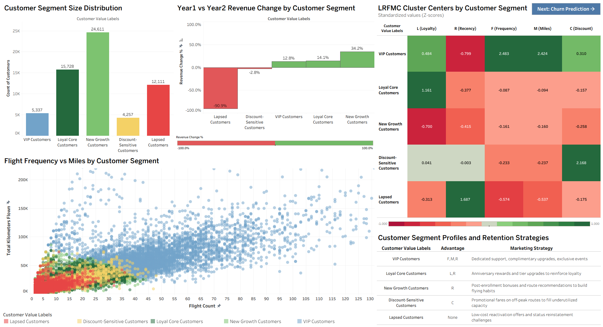
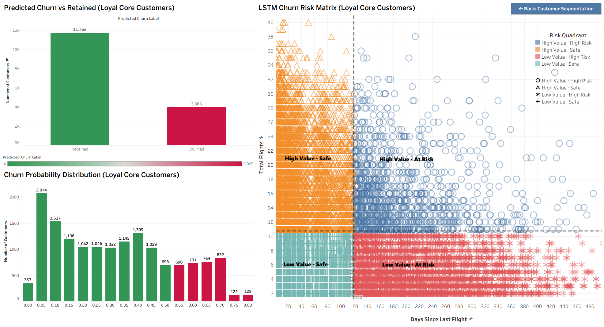

# Airline Customer Segmentation & Churn Prediction

## Project Overview

**Objective:** Segment 62K+ airline frequent flyer program members using the LRFMC framework and predict churn risk among loyal core customers for data-driven marketing and retention strategies.

**Business Value:** Targeted marketing strategies based on distinct customer value profiles and proactive retention for at-risk customers.

---

## Data

- **Data Source:** Chinese airline frequent flyer program dataset
- **Records:** 62,988 customers (62,044 after cleaning)
- **Raw Features:** 44 columns including flight frequency, mileage, membership duration, points activity, discount behavior, and demographics

---

## Methodology

### 1. Data Cleaning

- Dropped rows with missing first-year or second-year ticket prices
- Removed records with zero ticket price, zero average discount, or zero total kilometers
- Final dataset: 62,044 × 44

### 2. LRFMC Feature Engineering

Condensed 44 raw columns into 5 behavioral features using the industry-standard LRFMC framework:

| Code  | Feature          | Definition                                      | Source               |
| ----- | ---------------- | ----------------------------------------------- | -------------------- |
| **L** | Loyalty Duration | Months since joining the frequent flyer program | LOAD_TIME − FFP_DATE |
| **R** | Recency          | Days since last flight                          | LAST_TO_END          |
| **F** | Frequency        | Total flights during observation window         | FLIGHT_COUNT         |
| **M** | Miles Flown      | Total kilometers during observation window      | SEG_KM_SUM           |
| **C** | Discount Rate    | Average discount coefficient across bookings    | avg_discount         |

**How to interpret LRFMC values:**

- L higher is better — longer tenure means more loyal
- R lower is better — smaller gap since last flight means more active
- F higher is better — more flights mean higher engagement
- M higher is better — more kilometers mean higher revenue contribution
- C higher signals price sensitivity and reliance on discounts

### 3. Standardization

All five features scaled to zero mean and unit variance using StandardScaler, so distance-based clustering isn't dominated by features with larger magnitudes (miles in tens of thousands vs. discount rate near 1).

### 4. Optimal k Selection

Evaluated two cluster-quality metrics across k = 3 to 9:

| Metric                  | Best k | Score    |
| ----------------------- | ------ | -------- |
| Silhouette Score        | 6      | ≈ 0.28   |
| Calinski-Harabasz Index | 4      | ≈ 21,800 |

**Final choice: k = 5** — a business-driven compromise between the two metrics. k=4 would merge small but strategically important segments (VIP, Discount-Sensitive); k=6 would fragment segments beyond actionable size.

### 5. K-Means Clustering

Trained with `n_clusters=5, random_state=123, n_init=10` on standardized LRFMC features.

### 6. Churn Prediction with LSTM

**Target variable:** For Loyal Core Customers (n=15,728), churn is defined as `LAST_TO_END > 120 days`. This threshold reflects 2-3x the typical high-value flyer activity cycle, and falls between the median (76 days) and 75th percentile (156 days) of the observed distribution.

**Input features:** 10 behavioral indicators including recent-vs-historical activity ratios (`Ration_L1Y_Flight_Count`, `Ration_L1Y_BPS`), point accumulation (`L1Y_BP_SUM`, `AVG_BP_SUM`), flight frequency (`FLIGHT_COUNT`, `AVG_FLIGHT_COUNT`), total miles (`SEG_KM_SUM`), annual spend (`SUM_YR_1`, `SUM_YR_2`), and discount rate (`avg_discount`).

**Model:** 2-layer LSTM, hidden size 64, BCE loss, Adam optimizer (lr=0.001), Early Stopping with patience=20.

---

## Key Results

### Customer Segmentation — 5 Segments

Cluster centers reported as z-scores (positive = above average; negative = below average).

| Segment            | Size   | %     | L     | R     | F     | M     | C     | Standout |
| ------------------ | ------ | ----- | ----- | ----- | ----- | ----- | ----- | -------- |
| New Growth         | 24,611 | 39.7% | −0.70 | −0.41 | −0.16 | −0.16 | −0.26 | R        |
| Loyal Core         | 15,728 | 25.3% | +1.16 | −0.38 | −0.09 | −0.09 | −0.16 | L, R     |
| VIP                | 5,337  | 8.6%  | +0.48 | −0.80 | +2.48 | +2.42 | +0.31 | F, M, R  |
| Lapsed             | 12,111 | 19.5% | −0.31 | +1.69 | −0.57 | −0.54 | −0.18 | None     |
| Discount-Sensitive | 4,257  | 6.9%  | +0.04 | −0.00 | −0.23 | −0.24 | +2.17 | C        |

### Segment Profiles and Targeted Strategy

| Segment                | Behavioral Profile                                       | Marketing / Retention Strategy                                           |
| ---------------------- | -------------------------------------------------------- | ------------------------------------------------------------------------ |
| **New Growth**         | Newest members, recently flew but low frequency          | Post-enrollment bonuses and route recommendations to build flying habits |
| **Loyal Core**         | Longest membership, still actively flying                | Anniversary rewards and tier upgrades to reinforce loyalty               |
| **VIP**                | Most frequent, highest miles, most recently active       | Dedicated support, complimentary upgrades, exclusive events              |
| **Lapsed**             | All metrics below average, longest gap since last flight | Low-cost reactivation offers and status reinstatement challenges         |
| **Discount-Sensitive** | Near-average except heavy discount reliance              | Promotional fares on off-peak routes to fill underutilized capacity      |

### Behavioral Analysis

Each segment is named based on its dominant LRFMC behavioral pattern:

**VIP Customers** have the highest flight frequency (F=+2.48) and total miles (M=+2.42), with the most recent activity (R=−0.80). They are the top revenue contributors and require premium service differentiation to prevent competitor poaching.

**Loyal Core Customers** have the longest membership duration (L=+1.16) and remain actively engaged. They have maintained consistent engagement over the longest membership period, and recognition of their loyalty is key to maintaining this relationship.

**New Growth Customers** are the newest members (L=−0.70) who have recently flown (R=−0.41) but have not yet built up frequency or miles. At 39.7% of the base, this is the largest segment and the primary growth engine. The onboarding experience in their first few months determines whether they graduate into Loyal Core or lapse into inactivity.

**Lapsed Customers** show the longest gap since their last flight (R=+1.69) with all other metrics below average. Their low frequency (F=−0.57) and short tenure (L=−0.31) suggest they never developed strong engagement with the program before becoming inactive. Thus, reactivation efforts should be low-cost and time-limited to test responsiveness before committing significant resources.

**Discount-Sensitive Customers** have near-average behavior across all dimensions except an extremely high discount rate (C=+2.17). They consistently book discounted fare classes. Rather than trying to shift them to premium fares, the optimal strategy is to channel them toward off-peak and low load factor routes where their bookings fill otherwise empty seats, generating positive marginal revenue.

### Churn Prediction Performance

On Loyal Core Customers (n=15,728):

- **Accuracy:** 0.7139
- **AUC:** 0.7699
- **Log Loss:** 0.5386

The model identifies loyal core customers at risk of churning, so the airline can step in with targeted retention campaigns.

---

## Strategic Recommendations

| Decision                    | Recommendation                                                                                           |
| --------------------------- | -------------------------------------------------------------------------------------------------------- |
| Marketing budget allocation | Differentiate spend by segment: VIP gets service investment, Lapsed gets low-cost reactivation offers    |
| Retention prioritization    | Combine LSTM churn score with segment tier — Loyal Core members with high churn score get first outreach |
| Product positioning         | Build two loyalty tracks: service-led for VIP / Loyal Core, price-led for Lapsed / Discount-Sensitive    |
| New member onboarding       | New Growth (40% of base) is the growth engine — invest in onboarding to graduate them into Loyal Core    |

---

## Tableau Dashboard

### Dashboard 1: Customer Segmentation



### Dashboard 2: Churn Prediction



For full interactivity and detailed views, explore the [live dashboard](https://public.tableau.com/views/Book_v1__17784489161220/CustomerSegmentation?:language=en-US&:sid=&:redirect=auth&:display_count=n&:origin=viz_share_link).

---

## Tech Stack

- **Python 3** — Pandas, NumPy
- **scikit-learn** — StandardScaler, K-Means, Silhouette Score, Calinski-Harabasz Index
- **PyTorch** — LSTM model for churn prediction
- **Tableau** — interactive dashboard and visualization
- **Matplotlib, Seaborn** — visualization

---

## Repository Structure

```
airline-customer-segmentation/
├── airline_customer_segmentation.ipynb   # Main notebook
├── README.md
├── tableau_dashboard_segmentation.png            # Dashboard preview
├── tableau_dashboard_churn.png                   # Dashboard preview
├── requirements.txt
└── .gitignore
```

Note: the raw data file `air_data.csv` is not tracked in Git due to size and source constraints.
